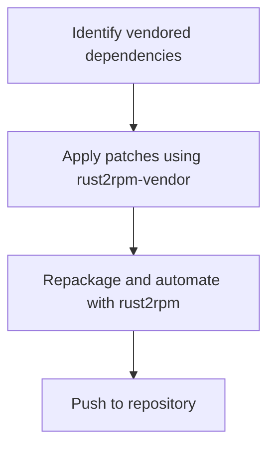

class: center, middle

# Managing Rust Dependencies in Linux Packaging

### Enhancing rust2rpm to Automate Patching and Repackaging of Vendored Dependencies

**Presenter:** Daniel Mellado, Mikel Olasagasti
**Event:** Fosdem 2025, distributions devroom
**Date:** Feb 2nd, 2025

---

# Introduction

- **Challenge:** Managing Rust dependencies in Linux distributions is complex.
- **Key Problems:** Missing packages, version mismatches, manual patching.
- **Goal:** Simplify the process for RPM-based distros.
- **Approach:** Automate patching and repackaging with rust2rpm tool.

---

# The Problem – Dependency Hell

- **Issue 1:** Managing numerous dependencies becomes overwhelming.
- **Issue 2:** Bundling dependencies can make it harder to apply patches.
- **Issue 3:** Fixing issues on-the-fly is difficult, especially with bundled dependencies.

---

# The Complications of Bundling Dependencies

- **Drawbacks:**
  - Maintenance overhead.
  - Limited flexibility for patches.
  - Complex manual steps for updates and fixes.

---

# Proposed Solution Overview

- **Enhancement 1:** Automate patching and repackaging of vendored dependencies.
- **Enhancement 2:** Simplify workflows for maintainers.
- **Goal:** Reduce complexity and improve Rust packaging in RPM-based distros.

---

# New `-p` Flag in rust2rpm

- **Feature:** `-p` flag to automate patching of vendored crates.
- **Benefits:**
  - Apply patches automatically.
  - Modify dependencies with minimal manual steps.
  - Repackage dependencies for easier management.

---

# Introducing rust2rpm-vendor Tool

- **Tool Purpose:** Prepare and patch vendor tarballs independently.
- **Automate Workflow:** From patch application to repackaging.
- **Result:** A more streamlined process for maintainers.

---

# How it Works – Workflow Diagram

---

# Benefits of the New Approach

- **Key Advantages:**
  - Reduced "dependency hell."
  - Faster, more reliable Rust packaging.
  - Fewer manual interventions and improved maintainability.

---

# Case Study – Fedora’s Rust Ecosystem

- **Example:** Demonstrating how these enhancements improve Fedora’s Rust packaging.
- **Challenges Addressed:**
  - Outdated dependencies.
  - Missing packages.
  - Complex workflows.
- **Outcome:** Easier maintenance and smoother packaging.

---

# Conclusion

- **Summary:**
  - Simplify the Rust packaging process for RPM-based distros.
  - Automate patching and repackaging with rust2rpm and rust2rpm-vendor.
  - Alleviate "dependency hell" and improve the overall packaging experience.

